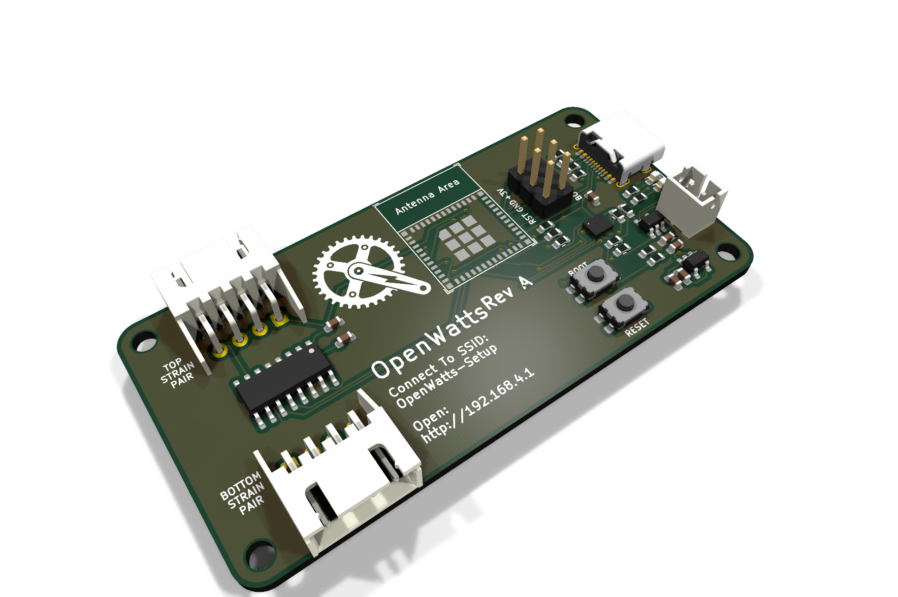

# OpenWatts

OpenWatts is a crank-mounted, single-sided cycling power meter built around an
ESP32-C3. A bonded strain-gauge bridge and HX711 measure crank torque, while an
LSM6DS3 IMU provides cadence and motion wake. Firmware publishes standard BLE
Cycling Power Service data and includes calibration, ride recording, battery
management, OTA updates, a responsive WebUI, and optional MQTT/Home Assistant
reporting.

The board in this repository is **OpenWatts RevA**, the same revision currently
installed on my bike. It has been calibrated and used with:

`OpenWatts --BLE CPS--> SmartSpin2K --> MyWhoosh`

## Features

- calibrated strain/HX711 torque and IMU cadence
- conventional single-sided total-power estimate: calibrated left-crank power
  doubled once for BLE Cycling Power, ride summaries, and road estimates
- Normal and Maintenance operating modes
- motion wake and battery-conscious light sleep
- guided Bench Calibration plus runtime Ride Zero
- phone-first live ride dashboard with read-only SmartSpin2K LAN data
- Last Ride statistics and estimated road distance/speed
- web OTA over USB or while working in Maintenance mode
- MQTT battery/ride reports and Home Assistant discovery

## Hardware

- [KiCad schematic](OpenWatts.kicad_sch)
- [KiCad PCB](OpenWatts.kicad_pcb)
- [BOM](HARDWARE_BOM.md)
- [schematic and board images](docs/hardware/)
- [PCBWay manufacturing files](fab/pcbway-2026-07-06/)
- [final-fit RevA board and case assembly](mechanical/OpenWatts_RevA_Enclosed_Assembly.step)
- [installation checklist](docs/INSTALLATION_CHECKLIST.md)
- [calibration guide](docs/CALIBRATION.md)

The checked-in KiCad PCB is the board that was manufactured. Notes from building
and using it are kept separately in [REV_B_NOTES.md](REV_B_NOTES.md) in case I
ever make another revision.

## Firmware

Firmware source and build instructions are in
[firmware/README.md](firmware/README.md). Start with the
[documentation index](docs/README.md) for setup, calibration, architecture,
Home Assistant, and validation notes.

## Notes

- RevA uses light sleep because its IMU interrupt is not connected to an
  ESP32-C3 deep-sleep-capable GPIO.
- Battery percentage is estimated from voltage, so the voltage reading is the
  useful number when accuracy matters.
- MQTT uses unauthenticated plain TCP on a trusted LAN.
- Road speed and distance are modeled estimates, not wheel/GPS measurements.
- OpenWatts measures left-crank torque only. It assumes approximately equal
  left/right contribution when estimating total cycling power; cadence itself
  is measured directly and is never doubled.

## License

OpenWatts is open hardware and open-source software:

- Hardware design, fabrication, and mechanical files:
  [CERN-OHL-P-2.0](LICENSES/CERN-OHL-P-2.0.txt)
- Firmware, WebUI, scripts, and documentation: [MIT](LICENSES/MIT.txt)

See [LICENSE.md](LICENSE.md) for the exact scope and warranty notice.

OpenWatts is provided as-is, without warranty. Building or using it is entirely
at your own risk. I am not responsible for injury, damaged equipment, battery
problems, inaccurate measurements, data loss, or other losses resulting from
its construction or use.
